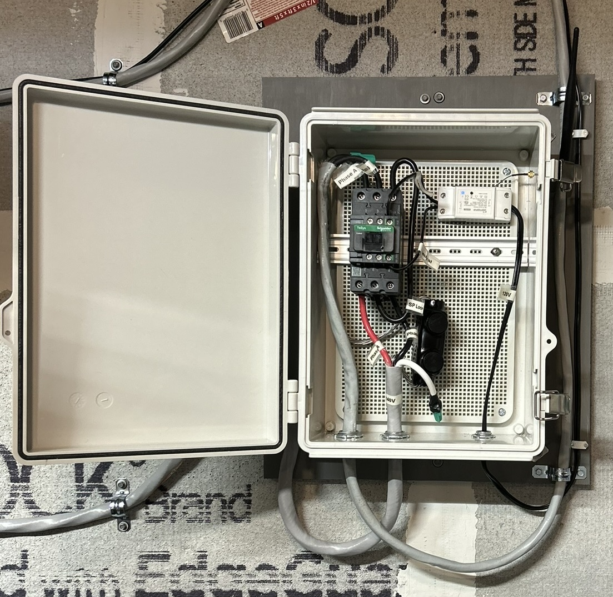
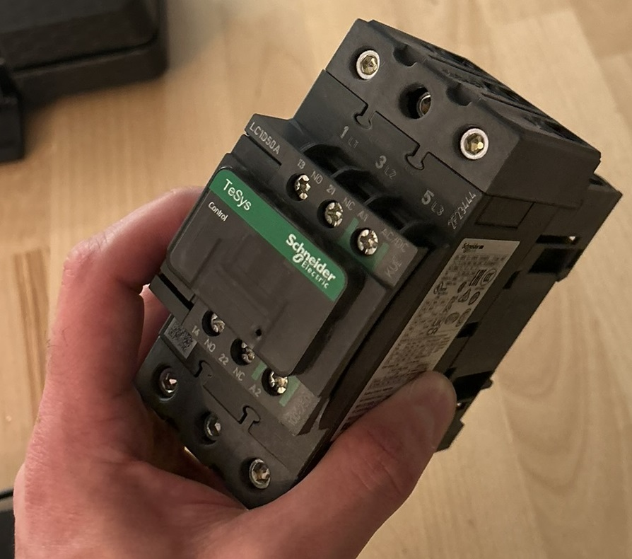
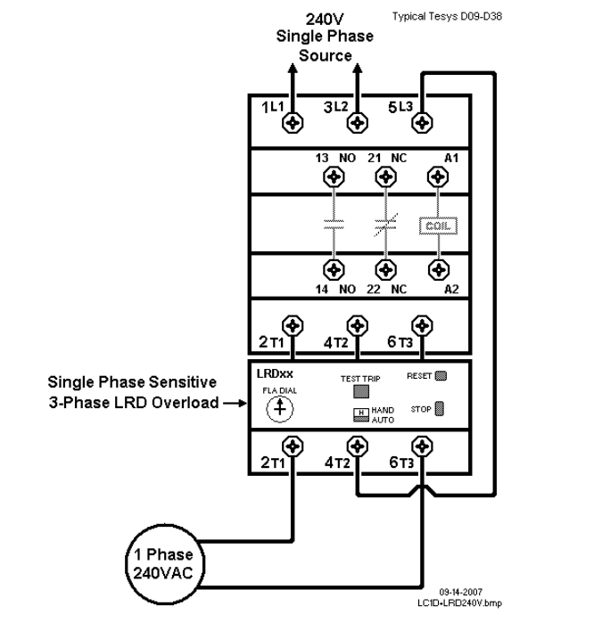
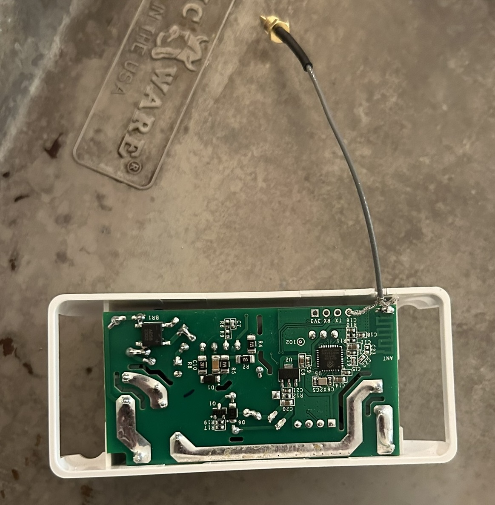

# ASIC Heating 
This post will document the process involved in planning, setup, and managing an ASIC miner is a household setting. There are several important areas to consider before purchasing an ASIC miner for use inside your home. Involving heating, power consumption, and remote management. Documenting the process and steps I took will be shared in this post.
<iframe width="560" height="315" src="https://www.youtube.com/embed/tIneY9daxnw?si=xXTt_P2DcuZ7qO-y" title="YouTube video player" frameborder="0" allow="accelerometer; autoplay; clipboard-write; encrypted-media; gyroscope; picture-in-picture; web-share" allowfullscreen></iframe>
<iframe width="560" height="315" src="https://www.youtube.com/embed/NFvkVF_3Z3E?si=Dd2QS4phLgK1I4l2" title="YouTube video player" frameborder="0" allow="accelerometer; autoplay; clipboard-write; encrypted-media; gyroscope; picture-in-picture; web-share" allowfullscreen></iframe>

## Table of Contents
1. [Power Plan](#power-plan)
    1. [Single-Phase 240 Volt 50 Amp Circuit](#single-phase-circuit)
    2. [Power Infrastructure - Products Used](#power-products)
2. [Configuring Miner through Web UI](#configuring-miner-through-web-ui)
    1. [Setup](#setup)
    2. [Firmware](#firmware)
3. [Installation of Silencing Kit](#installation-of-silencing-kit)
4. [Remote Power Switch](#remote-power-switch)
    1. [Why Use A Smart Switch?](#why-use-a-smart-switch)
    2. [Contactor](#contactor)
    3. [WiFi Relay](#wifi-relay)
    4. [Electrical Box](#electrical-Box)
        1. [Electrical Box - Products used](#electrical-box-products)
5. [Managing Heat](#managing-heat)
    1. [Configuring Heat Direction](#configuring-heat-direction)
        1. [HVAC Products Used](#hvac-products)
    2. [Furnace Fans and Energy Reports](#energy-report)
        1. [Wireless Products Used](#google-products)
6. [Future Considerations](#future-considerations)

## **Power Plan**
### Single-Phase 240 Volt 50 Amp Circuit

Utilizing an existing circuit was the cornerstone of formulating my power plan. The circuit in question was a 240 volt 50 amp setup, which implied that finding a suitable PDU would be challenging.

Typically, in industrial data centers, the standard cut-off is at 30 amps. This means that the majority of PDUs available on the market are configured for 240 volts but are capped at 30 amps. There's a solid rationale behind this limitation—it aids in the management of devices per breaker within a facility, thereby facilitating easier isolation of power usage.

When devising a power plan with a specific budget in mind for a facility, it's common practice to assess how many devices can be supported by a 30 amp supply and to restrict those devices to that particular circuit. Should there be a requirement for additional power, it's advisable to allocate another dedicated circuit with its own breaker. This approach forms the basis of the power planning strategy.

### Power Infrastructure - Products Used 

- <a target="_blank" href="https://www.amazon.com/gp/product/B0BFFB458M/ref=ppx_yo_dt_b_search_asin_title?ie=UTF8&amp;psc=1&_encoding=UTF8&tag=codypaternost-20&linkCode=ur2&linkId=a9ddd6b402e715f57bfcf0a9944ea4bb&camp=1789&creative=9325">Valiant Power Surge Protection Metered Rack Mount PDU Basic 220v 50a</a>
- <a target="_blank" href="https://www.amazon.com/EDYCARX-Receptacle-Industrial-Outlet-Surface/dp/B0C4FHQ4NL/ref=sr_1_7?crid=UL1FDQDQ3YIA&amp;keywords=L6-50r%252Bblack&amp;qid=1707014530&amp;sprefix=l6-50r%252Bblac%252Caps%252C115&amp;sr=8-7&amp;th=1&_encoding=UTF8&tag=codypaternost-20&linkCode=ur2&linkId=7a11142179905bebf9f17cca03b8f360&camp=1789&creative=9325">Nema 6-50 Receptacle Industrial Grade 50 Amp Outlet Surface Mount Receptacle 2-Pole 3-Wire Nema 6-50r</a>
- <a target="_blank" href="https://www.amazon.com/gp/product/B001348EDC/ref=ppx_yo_dt_b_search_asin_title?ie=UTF8&amp;th=1https://www.amazon.com/gp/product/B001348EDC/ref=ppx_yo_dt_b_search_asin_title?ie=UTF8&amp;th=1&_encoding=UTF8&tag=codypaternost-20&linkCode=ur2&linkId=7b1e9fae45399d10a7095922959ec344&camp=1789&creative=9325">Tripp Lite Heavy-Duty Computer Power Extension Cord for Servers and Computers 20A 12AWG EC-320-C19 to IEC-320-C20</a>
- <a target="_blank" href="https://www.amazon.com/gp/product/B09R6JM1VC/ref=ppx_yo_dt_b_search_asin_title?ie=UTF8&amp;th=1&_encoding=UTF8&tag=codypaternost-20&linkCode=ur2&linkId=f00c7d69d2cd5068fea4916b72d2f3bc&camp=1789&creative=9325">Dracaena 2 Pack PDU UPS Power IEC Male C14 to Female C19 Adapter IEC Connector </a>

*(adapters are not needed for this project but are useful to have)*

## **Configuring Miner through Web UI**
### Setup

There is a wealth of information available for configuring the KS3M device for the first time. However, IceRiver does not list a manual specifically for the KS3M, although its configuration process is nearly identical to that of the KS3 and KS3L models. For your convenience, Zeus Mining has reformatted the provided PDF manual. You can find both resources below:

- [IceRiver KS3 and KS3L Operation Manual and Troubleshooting](https://www.zeusbtc.com/articles/information/4718-iceriver-ks3-ks3l-operation-manual-and-troubleshooting)
- [IceRiver Product Manuals, Tools, and Firmware](https://www.iceriver.io/tutorial/)

### Firmware

For those looking to download the latest firmware, please use the link below:

- [Firmware Download](https://www.iceriver.io/firmware-download/)

*Note: As of this writing, the latest firmware version is* `ICM168_2_1_0_ks3mupdate.bgz`. This update includes:

1. A fix for the issue of hashboards dropping under low and normal temperature conditions.
2. Corrections for some common bugs.

## **Installation of Silencing Kit**

I decided to document the silencing kit installation by recording the process. 
Feel free to comment to on anything provided in this blog at the bottom of the page!

[Silencing Kit Installation](https://youtu.be/tIneY9daxnw?si=ualFuQoHbqlXtb2A)

## **Remote Power Switch**

### Why Use A Smart Switch?

Integrating a smart switch into the entire system is highly beneficial for remote management or automation, particularly when dealing with 240v single-phase circuits where conventional switches might not suffice. This section explores the rationale behind opting for a smart switch, underlining its advantages in remote operations and automation flexibility.

Given the unique requirements of a 240-volt 50 amp circuit, off-the-shelf solutions were inadequate, prompting the creation of a custom switch. This endeavor involved selecting components that could reliably handle the specified power load while adhering to safety standards. 

Example:
- <a target="_blank" href="https://www.amazon.com/Migro-Outdoor-Resistive-Wireless-Compatible/dp/B07WC2BT85/ref=sr_1_2?crid=2XLDLSISRZ8TR&amp;keywords=MIGRO+Wi-Fi+Smart+Controller+240VAC&amp;qid=1707097573&amp;sprefix=migro+wi-fi+smart+controller+240vac%252Caps%252C99&amp;sr=8-2&amp;ufe=app_do%253Aamzn1.fos.18ed3cb5-28d5-4975-8bc7-93deae8f9840&_encoding=UTF8&tag=codypaternost-20&linkCode=ur2&linkId=fcf5f6db25e9f73ef23f4e74decdd2d3&camp=1789&creative=9325">MIGRO Wi-Fi Smart Controller 240VAC</a>

### Contactor

The heart of the custom switch is a contactor, specifically chosen for its capability to manage high loads. The selection was guided by the need for a device that could handle 50 amps continuously, considering the 80/20 rule to avoid overloading. The Schneider Electric LC1D50AKUE contactor, operating in a Normally Open state, was ideal, ensuring that power would be cut off in the absence of a signal, thereby providing an added layer of safety. Additionally, the option for manual latching was incorporated to allow for physical control over the system's power state.

- [Schneider Electric LAD6K10 Latch Block Product Data Sheet](https://download.schneider-electric.com/files?p_enDocType=Instruction+sheet&p_File_Name=151217401A55.pdf&p_Doc_Ref=1512174_01A55)

It's important to know the difference between Definite Purpose and General Purpose contactors. C3controls does a fantastic job explaining the difference between the two. Since I was looking for something robust and wasn’t designed for a specific application, one that was not meant to last as long ideally. 

- [c3controls: *Definite Purpose vs General Purpose Contractor Explanation*](https://www.c3controls.com/white-paper/definite-purpose-contactors-everything-you-need-to-know/ )

Deciding to construct a custom switch suitable for a 240 volt 50 amp circuit involved significant research. I was drawn to Schneider Electric's products for their reliability and quality. A notable obstacle encountered was the need for a contactor capable of functioning in a single-phase system, rather than the more commonly designed multi-phase systems. Schneider Electric provided a valuable diagram that illustrates how to correctly wire their contactor for single-phase power supply, ensuring the project's success.

- [Single-Phase Wiring on Multi-Phase Contactor](https://www.se.com/th/en/faqs/FA339640/)

- [Schneider Electric LC1D50AKU Contactor](https://www.se.com/us/en/product/LC1D50AKUE/iec-contactor-tesys-deca-green-nonreversing-50a-40hp-at-480vac-up-to-100ka-sccr-3-phase-3-no-100-250vac-vdc-coil/)
- [Product Data Sheet](https://www.se.com/us/en/product/download-pdf/LC1D50AKUE?filename=Schneider+Electric_TeSys-Deca-Contactors_LC1D50AKUE.pdf)

### WiFi Relay

For remote control capabilities, the SONOFF Basic R2 was chosen for its compatibility with the contactor and its ease of integration into the system. This smart WiFi switch enables the modification of the contactor's state via wireless signals, thus facilitating remote operations.

- <a target="_blank" href="https://www.amazon.com/gp/product/B07KP8THFG/ref=ppx_yo_dt_b_search_asin_title?ie=UTF8&amp;th=1&_encoding=UTF8&tag=codypaternost-20&linkCode=ur2&linkId=6229be5610313ec9ce82b80390d5fbf1&camp=1789&creative=9325">SONOFF Basic R2 10A Smart WiFi Wireless Light Switch</a>

I did purchase an antenna to incorporate into the box. You will have to solder on the antenna for this model, but it was possible. 

- <a target="_blank" href="https://www.amazon.com/gp/product/B00TI1XBOE/ref=ppx_yo_dt_b_search_asin_title?ie=UTF8&amp;th=1&_encoding=UTF8&tag=codypaternost-20&linkCode=ur2&linkId=323e957a2d4e2c6ef8eb0673de76a9b7&camp=1789&creative=9325">Dual Band WiFi 2-4GHz 5GHz Male Antenna for WiFi Router</a>

Simply used lamp wire and plug to power the SONOFF relay

### Electrical Box

To house the components and ensure their safe operation, a custom electrical box was designed. This box not only protects the components but also integrates a dual-band WiFi antenna, enhancing the system's connectivity. The inclusion of the antenna required some modification to the SONOFF Basic R2, namely soldering the antenna onto the device for improved signal reception.

#### Electrical Box - Products used
- <a target="_blank" href="https://www.amazon.com/gp/product/B07H2ZMX8R/ref=ppx_yo_dt_b_search_asin_title?ie=UTF8&amp;psc=1&_encoding=UTF8&tag=codypaternost-20&linkCode=ur2&linkId=86585a5d9beffba1022415691528bc0c&camp=1789&creative=9325">Hinged Cover Stainless Steel Latch 370x270x150mm Junction Box with Mounting Plate</a>
- <a target="_blank" href="https://www.amazon.com/gp/product/B07H2ZMX8R/ref=ppx_yo_dt_b_search_asin_title?ie=UTF8&amp;psc=1&_encoding=UTF8&tag=codypaternost-20&linkCode=ur2&linkId=86585a5d9beffba1022415691528bc0c&camp=1789&creative=9325">Hinged Cover Stainless Steel Latch 370x270x150mm Junction Box with Mounting Plate</a>

*The rails did require some length trimming.*

## **Managing Heat**

The KS3M, with its hefty 3,200-watt power consumption, generates significant heat, necessitating efficient management strategies. For those in cooler climates, this presents an opportunity to either redistribute the heat within your home, potentially reducing heating costs, or vent it outside. Utilizing a fan shroud kit, you can employ an inline fan not only to cool the miner but also to channel the heat where it's needed most.

Imagine your miner as a compact furnace equipped with its own fan system. You have the option to direct this heat outside through an exhaust vent or integrate it into your home's HVAC system. Specifically, the miner's warmth can be fed into the cold air return, leveraging the existing heating and cooling infrastructure. To circulate this heat throughout your home, you could use the furnace fan—without activating the furnace's heating element—allowing the miner's heat to be distributed evenly. Keeping the furnace fan running constantly ensures steady air movement. For a more sophisticated setup, introducing electronically controlled dampers could further streamline the heating process, paving the way for a fully automated system. More advanced options and setups are discussed in the future considerations section.

*See future considerations for more details.*

### Configuring Heat Direction

This configuration example showcases how heat generated can be strategically redirected to an alternate space, such as a garage, offering a practical solution for managing excess warmth. Should the interior of the house become overly heated, the system allows for the adjustment of heat flow towards the garage. This setup exemplifies how you can prioritize different areas within your premises for heat distribution—first to spaces of higher importance, followed by those of lower priority, and finally, outside if necessary. This approach not only enhances comfort but also optimizes the use of generated heat according to your specific needs and preferences.

*Exhausting outside would be an easier solution but would not offer recylcing the heat from the miner*

#### HVAC Products Used

- <a target="_blank" href="https://www.amazon.com/gp/product/B07BQS1GB9/ref=ppx_yo_dt_b_search_asin_title?ie=UTF8&amp;psc=1&_encoding=UTF8&tag=codypaternost-20&linkCode=ur2&linkId=061ed0ecbc6af371a85b21eb556d4ee0&camp=1789&creative=9325">AC Infinity CLOUDLINE PRO T8</a>
- <a target="_blank" href="https://www.amazon.com/gp/product/B0829DZB9W/ref=ppx_yo_dt_b_search_asin_title?ie=UTF8&amp;psc=1&_encoding=UTF8&tag=codypaternost-20&linkCode=ur2&linkId=33f0691ffdecf2263889323627d5c9e2&camp=1789&creative=9325">AC Infinity Inline Duct Fan Silencer</a>
- <a target="_blank" href="https://www.amazon.com/gp/product/B07GTGY8PD/ref=ppx_yo_dt_b_search_asin_title?ie=UTF8&amp;psc=1&_encoding=UTF8&tag=codypaternost-20&linkCode=ur2&linkId=bddba7981412c00589499c39685b27d7&camp=1789&creative=9325">AC Infinity Air Carbon Filter</a>
- <a target="_blank" href="https://www.amazon.com/VEVOR-Heavy-Duty-Protection-Ventilation-Insulation/dp/B0CS2DRSTG/ref=sr_1_3?crid=2XLJPTCELMNVJ&amp;keywords=insulated%252B8inch&amp;qid=1707693226&amp;sprefix=insulated%252B8inch%252B%252Caps%252C150&amp;sr=8-3&amp;th=1&_encoding=UTF8&tag=codypaternost-20&linkCode=ur2&linkId=d2996d6e5fb1e720d480398fece351d6&camp=1789&creative=9325">VEVOR 8 Inch Insulated Flexible Duct</a>
- <a target="_blank" href="https://www.amazon.com/Imperial-Manufacturing-Furnace-Pipe-Galvanized/dp/B000BQQ1GU/ref=sr_1_2?crid=TQYHONTIUKFU&amp;keywords=8inch+tee&amp;qid=1707693293&amp;sprefix=8inch+te%252Caps%252C139&amp;sr=8-2&_encoding=UTF8&tag=codypaternost-20&linkCode=ur2&linkId=15501948a2b692b2b4765edd69d2c3ad&camp=1789&creative=9325">Imperial Manufacturing Furnace Pipe Full Flow Tee</a>
- <a target="_blank" href="https://www.amazon.com/dp/B00E0Q4IZI?ref=ppx_yo2ov_dt_b_product_details&amp;th=1&_encoding=UTF8&tag=codypaternost-20&linkCode=ur2&linkId=52104ee18e4c83d0293734010658d381&camp=1789&creative=9325">HVAC FAMCO 8 Inch Butterfly Backdraft Damper for Heat Exchangers</a>
- <a target="_blank" href="https://www.amazon.com/dp/B0BRD47Q67?psc=1&amp;ref=ppx_yo2ov_dt_b_product_details&_encoding=UTF8&tag=codypaternost-20&linkCode=ur2&linkId=096a71c9a3c146c999c8dac8156802fd&camp=1789&creative=9325">PATIKIL 8 Inch Duct Connector Flange</a>
- <a target="_blank" href="https://www.amazon.com/PATIKIL-Adjustment-Airflow-Backdraft-Ventilation/dp/B0BRK728W3/ref=sr_1_7?crid=272I4R5O14PC4&amp;keywords=8%252Binch%252Bdamper&amp;qid=1707693419&amp;s=hi&amp;sprefix=8%252Binch%252Bdampe%252Ctools%252C178&amp;sr=1-7&amp;th=1&_encoding=UTF8&tag=codypaternost-20&linkCode=ur2&linkId=3bb73e604ff68c19447a5af7a5e67dd5&camp=1789&creative=9325">PATIKILHVAC Duct Manual Volume Damper Metal Adjustment Airflow Ducting Backdraft Damper Control for Air Ventilation System </a>
- <a target="_blank" href="https://www.amazon.com/Handua-Steel-Damper-Supply-Diffuser/dp/B0C5ZKNJBB/ref=sr_1_23?crid=3PEYTI4FJH8OY&amp;keywords=8%252Binch%252Bcircular%252Bregister&amp;qid=1707693562&amp;s=hi&amp;sprefix=8%252Binch%252Bcircular%252Bregiste%252Ctools%252C150&amp;sr=1-23&amp;th=1&_encoding=UTF8&tag=codypaternost-20&linkCode=ur2&linkId=61594546607db41d2047fec2a953fd04&camp=1789&creative=9325">Steel Damper for Air Supply Diffuser</a>
- <a target="_blank" href="https://www.amazon.com/Round-Ceiling-Diffuser-White-Dimensions/dp/B0116EY8T2/ref=sr_1_3?crid=3PEYTI4FJH8OY&amp;keywords=8+inch+circular+register&amp;qid=1707693500&amp;s=hi&amp;sprefix=8+inch+circular+registe%252Ctools%252C150&amp;sr=1-3&_encoding=UTF8&tag=codypaternost-20&linkCode=ur2&linkId=3b83b3c2081f8983ffd04b520c6680cc&camp=1789&creative=9325">HVAC Vent Duct Cover Round Ceiling Diffuser</a>
- <a target="_blank" href="https://www.amazon.com/Aluminum-Insulation-Adhesive-Temperature-Ductwork/dp/B09BHWMSTD/ref=sr_1_3?crid=2Q6K138BD1L8V&amp;keywords=metal+tape+hvac&amp;qid=1707693606&amp;s=hi&amp;sprefix=metal+tape+hva%252Ctools%252C134&amp;sr=1-3&_encoding=UTF8&tag=codypaternost-20&linkCode=ur2&linkId=4ca7cbe6cdc0f3a95c267e52b5fd2d31&camp=1789&creative=9325">Metal High Temperature Heavy Duty HVAC Tape Aluminum Foil Tape </a>
- <a target="_blank" href="https://www.amazon.com/Stainless-Washer-Drilling-Screws-Tapping/dp/B076BYJSTW/ref=sr_1_1_sspa?crid=1OXNRTYD5VYB0&amp;keywords=hvac+self+tappers&amp;qid=1707693670&amp;s=hi&amp;sprefix=hvac+self+tapper%252Ctools%252C147&amp;sr=1-1-spons&amp;sp_csd=d2lkZ2V0TmFtZT1zcF9hdGY&amp;psc=1&_encoding=UTF8&tag=codypaternost-20&linkCode=ur2&linkId=450b03615057885cad2cb952ceff7032&camp=1789&creative=9325">410 Stainless Steel Self Tapping TEK Screws</a>

### Furnace Fans and Energy Reports

Google Nest made controlling the Furnace Fans a breeze… 

Integrating Google Home with Google Automation, alongside a Google Nest, has revolutionized the control of Furnace Fans, making it effortlessly manageable. Google's automation capabilities enable the straightforward addition of compatible devices to your network, all controllable via its app. It's even possible to craft scripts for comprehensive device management, providing tailored automation for heating solutions. In this scenario, devices such as the SONOFF 50 Amp remote (Smart Switch), a Miner Light (Shop Light), and a Thermostat (Server Room) illustrate the seamless integration and control achievable with this setup.

Using Google Nest to set a rule for continuous furnace fan usage. 

Observing furnace activity while leveraging a miner for supplemental heat reveals a remarkable reduction in furnace use, especially during the winter months. This innovative approach essentially minimizes traditional furnace reliance by utilizing the heat generated from mining operations. The result is a substantial decrease in furnace usage throughout the colder season, showcasing an efficient and cost-effective method of maintaining warmth within the home.

#### Wireless Products Used
- <a target="_blank" href="https://www.amazon.com/Nest-T3021US-Thermostat-Temperature-Generation/dp/B01MYE7VDD/ref=sr_1_4?crid=182IUUDGVGE9I&amp;keywords=google%252Bnest&amp;qid=1707693725&amp;s=hi&amp;sprefix=google%252Bnes%252Ctools%252C147&amp;sr=1-4&amp;th=1&_encoding=UTF8&tag=codypaternost-20&linkCode=ur2&linkId=d1b5fbd1912ce0eeaf3e9ae26b75b374&camp=1789&creative=9325">Google Nest Learning Thermostat Programmable Smart Thermostat for Home 3rd Generation</a>
- <a target="_blank" href="https://www.amazon.com/Nest-T5000SF-Sensor-Thermostat/dp/B07DGWXCNN/ref=sr_1_1_pp?crid=3JVTH60JFQBH0&amp;keywords=google+thermostat&amp;qid=1707693811&amp;s=hi&amp;sprefix=gogole+thermo%252Ctools%252C175&amp;sr=1-1&_encoding=UTF8&tag=codypaternost-20&linkCode=ur2&linkId=700c5b00b6428759e82e79f72d093d5e&camp=1789&creative=9325">Google Nest Temperature Sensor That Works with Nest Learning Thermostat</a>
- <a target="_blank" href="https://www.amazon.com/TP-Link-Tapo-Compatible-Certified-P125M/dp/B0BNWGZ545/ref=sr_1_4?crid=3J61PV0HV8AN2&amp;keywords=tp%252Blink%252Bwifi%252Bplug&amp;qid=1707693853&amp;s=hi&amp;sprefix=tp%252Blink%252Bwifi%252Bpluig%252Ctools%252C139&amp;sr=1-4&amp;th=1&_encoding=UTF8&tag=codypaternost-20&linkCode=ur2&linkId=4ad346a8e1fd1fe0356ec3ff0a48227d&camp=1789&creative=9325">TP Link Tapo Matter Compatible Smart Plug Mini</a>

## **Future Considerations**

I would like to add more features such as electrical dampers and automations via Google Automate. 