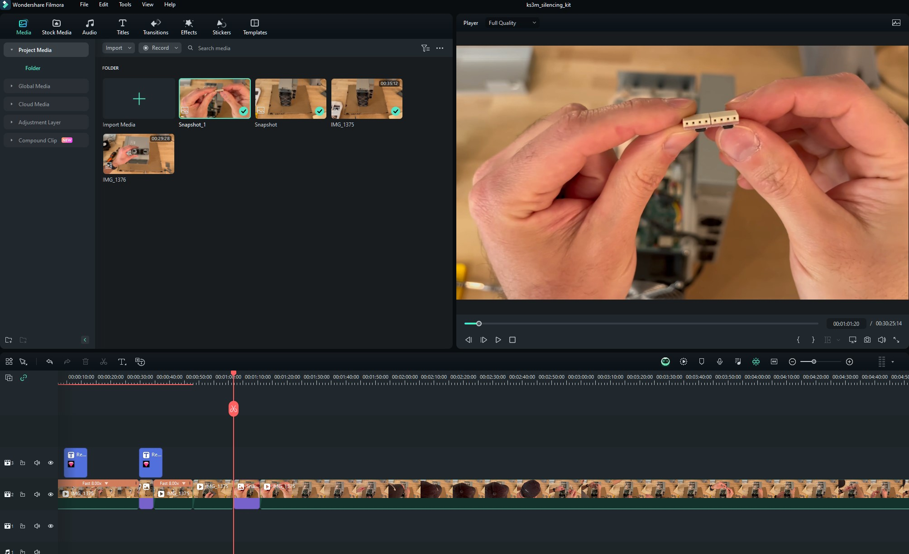
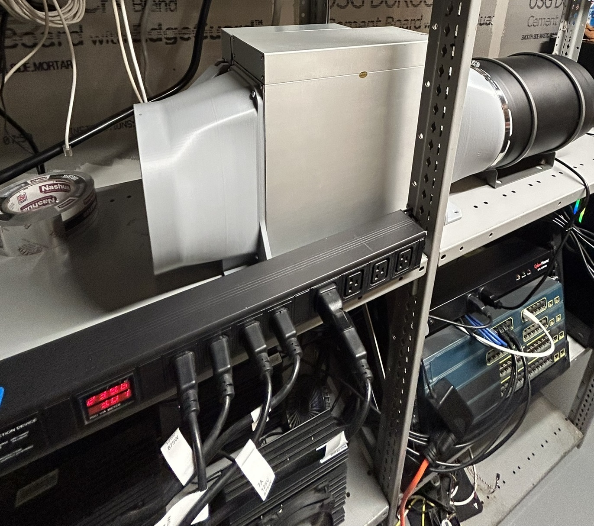

# ASIC Heating 
This post will document the process involved in planning, setup, and managing an ASIC miner is a household setting. There are several important areas to consider before purchasing an ASIC miner for use inside your home. Involving heating, power consumption, and remote management. Documenting the process and steps I took will be shared in this post.

## *Table of Contents*
1. [Introduction](#introduction)
2. [Power Plan](#power-plan)
3. [Configuring Miner through Web UI](#configuring-miner-through-web-ui)
4. [Installation of Silencing Kit](#installation-of-silencing-kit)
5. [Remote Power Switch](#remote-power-switch)
6. [Managing Heat](#managing-heat)
7. [Future Considerations](#future-considerations)

### Introduction 
[Silencing Kit Installation](https://youtu.be/tIneY9daxnw?si=ualFuQoHbqlXtb2A)
#
I decided to document the silencing kit installation by recording the process!
<iframe width="560" height="315" src="https://www.youtube.com/embed/tIneY9daxnw?si=xXTt_P2DcuZ7qO-y" title="YouTube video player" frameborder="0" allow="accelerometer; autoplay; clipboard-write; encrypted-media; gyroscope; picture-in-picture; web-share" allowfullscreen></iframe>

### Power Plan

#### Single-Phase 240 Volt 50 Amp Circuit

Utilizing an existing circuit was the cornerstone of formulating my power plan. The circuit in question was a 240 volt 50 amp setup, which implied that finding a suitable PDU would be challenging.

Typically, in industrial data centers, the standard cut-off is at 30 amps. This means that the majority of PDUs available on the market are configured for 240 volts but are capped at 30 amps. There's a solid rationale behind this limitation—it aids in the management of devices per breaker within a facility, thereby facilitating easier isolation of power usage.

When devising a power plan with a specific budget in mind for a facility, it's common practice to assess how many devices can be supported by a 30 amp supply and to restrict those devices to that particular circuit. Should there be a requirement for additional power, it's advisable to allocate another dedicated circuit with its own breaker. This approach forms the basis of the power planning strategy.

#### Power Infrastructure - Products Used 

- <a target="_blank" href="https://www.amazon.com/gp/product/B0BFFB458M/ref=ppx_yo_dt_b_search_asin_title?ie=UTF8&amp;psc=1&_encoding=UTF8&tag=codypaternost-20&linkCode=ur2&linkId=a9ddd6b402e715f57bfcf0a9944ea4bb&camp=1789&creative=9325">Valiant Power Surge Protection Metered Rack Mount PDU Basic 220v 50a</a>
- <a target="_blank" href="https://www.amazon.com/EDYCARX-Receptacle-Industrial-Outlet-Surface/dp/B0C4FHQ4NL/ref=sr_1_7?crid=UL1FDQDQ3YIA&amp;keywords=L6-50r%252Bblack&amp;qid=1707014530&amp;sprefix=l6-50r%252Bblac%252Caps%252C115&amp;sr=8-7&amp;th=1&_encoding=UTF8&tag=codypaternost-20&linkCode=ur2&linkId=7a11142179905bebf9f17cca03b8f360&camp=1789&creative=9325">Nema 6-50 Receptacle Industrial Grade 50 Amp Outlet Surface Mount Receptacle 2-Pole 3-Wire Nema 6-50r</a>
- <a target="_blank" href="https://www.amazon.com/gp/product/B001348EDC/ref=ppx_yo_dt_b_search_asin_title?ie=UTF8&amp;th=1https://www.amazon.com/gp/product/B001348EDC/ref=ppx_yo_dt_b_search_asin_title?ie=UTF8&amp;th=1&_encoding=UTF8&tag=codypaternost-20&linkCode=ur2&linkId=7b1e9fae45399d10a7095922959ec344&camp=1789&creative=9325">Tripp Lite Heavy-Duty Computer Power Extension Cord for Servers and Computers 20A 12AWG EC-320-C19 to IEC-320-C20</a>
- <a target="_blank" href="https://www.amazon.com/gp/product/B09R6JM1VC/ref=ppx_yo_dt_b_search_asin_title?ie=UTF8&amp;th=1&_encoding=UTF8&tag=codypaternost-20&linkCode=ur2&linkId=f00c7d69d2cd5068fea4916b72d2f3bc&camp=1789&creative=9325">Dracaena 2 Pack PDU UPS Power IEC Male C14 to Female C19 Adapter IEC Connector </a>

*(adapters are not needed for this project but are useful to have)*
### Configuring Miner through Web UI

#### Setup

There is a wealth of information available for configuring the KS3M device for the first time. However, IceRiver does not list a manual specifically for the KS3M, although its configuration process is nearly identical to that of the KS3 and KS3L models. For your convenience, Zeus Mining has reformatted the provided PDF manual. You can find both resources below:

- [IceRiver KS3 and KS3L Operation Manual and Troubleshooting](https://www.zeusbtc.com/articles/information/4718-iceriver-ks3-ks3l-operation-manual-and-troubleshooting)
- [IceRiver Product Manuals, Tools, and Firmware](https://www.iceriver.io/tutorial/)

#### Firmware

For those looking to download the latest firmware, please use the link below:

- [Firmware Download](https://www.iceriver.io/firmware-download/)

**Note:** As of this writing, the latest firmware version is `ICM168_2_1_0_ks3mupdate.bgz`. This update includes:

1. A fix for the issue of hashboards dropping under low and normal temperature conditions.
2. Corrections for some common bugs.

### Installation of Silencing Kit

### Remote Power Switch

### Managing Heat

### Future Considerations