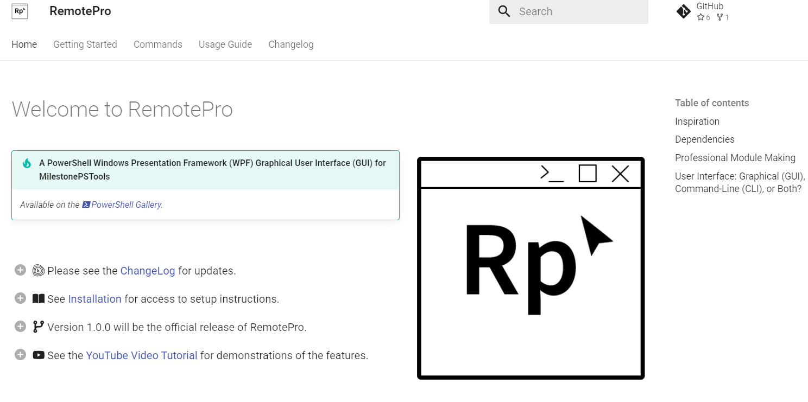
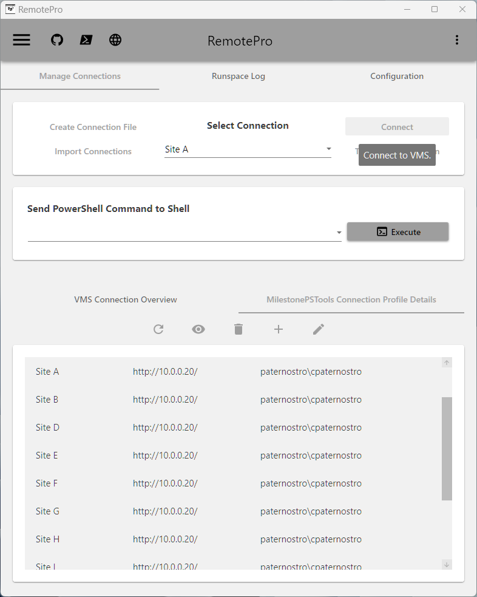

## PowerShell: RemotePro

## Overview

> Hello! My name is Cody Paternostro, and this is my project, RemotePro. It is an intriguing module that allows anyone familiar with MilestonePSTools and Milestone XProtect to interact through a graphical user interface (GUI). The idea for RemotePro originated when Joshua Hendricks, the developer behind the MilestonePSTools project, shared an interesting PowerShell script. This script wasn’t designed for automation; instead, it focused on user interaction by enabling the viewing of live and playback streams from a Video Management System (VMS). He utilized Windows Presentation Framework (WPF), which was new to me at the time. This journey has been a long one, providing an opportunity to create something usable by everyone with minimal effort.

## Getting Started

!!! Info 
    To get started with RemotePro, visit the official website at [RemotePro.dev](https://www.remotepro.dev/). Here, you will find detailed documentation, installation guides, and support resources to help you make the most of the module.

## Features

- **User-Friendly Interface**: RemotePro offers a clean and intuitive GUI, making it easy for users to interact with Milestone XProtect.
- **Live and Playback Streams**: View live and recorded video streams directly from the VMS.
- **WPF Integration**: Leverages the power of Windows Presentation Framework for a seamless user experience.
- **PowerShell Backend**: Built on PowerShell, allowing for powerful scripting and automation capabilities.
- **Cross-Platform Compatibility**: Works on various Windows versions, ensuring broad accessibility.

 

